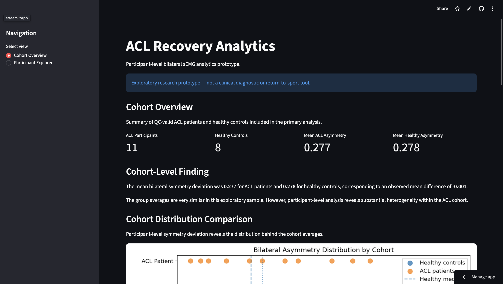

# ACL Recovery Analytics

An end-to-end analytics project using bilateral surface electromyography (sEMG) data to explore muscle activation asymmetry following ACL reconstruction.

🔗 **Live Dashboard:** https://acl-rehab-analytics.streamlit.app

## Dashboard Preview



## Project Overview

Recovery after ACL reconstruction is highly individual. Group-level averages may hide meaningful differences in muscle activation between patients.

This project develops an exploratory analytics pipeline that processes bilateral sEMG recordings, extracts muscle activation features, compares ACL participants with healthy controls, and presents participant-level patterns through an interactive Streamlit dashboard.

The goal is to demonstrate how data analytics can make rehabilitation-related measurements easier to interpret and explore.

> **Note:** This is an exploratory research prototype and is not intended for clinical diagnosis, rehabilitation recommendations, or return-to-sport decisions.

## Key Questions

This project explores three main questions:

1. How different is muscle activation between the involved and uninvolved sides?
2. How does an ACL participant's bilateral asymmetry compare with a healthy reference group?
3. Can participant-level analytics reveal patterns that are hidden by cohort averages?

## Dataset

The analysis uses bilateral sEMG recordings from ACL participants and healthy controls.

After signal-quality screening, the primary analytical sample contains:

- 11 ACL participants
- 8 healthy controls

Raw signal files are excluded from the public repository. Processed participant-level features used by the dashboard are included for reproducibility.

## Analytics Pipeline

The project follows an end-to-end workflow:

Raw sEMG Signals  
→ Signal Processing  
→ Contraction Detection & Quality Control  
→ Feature Engineering  
→ Bilateral Comparison  
→ Healthy Reference Analysis  
→ Participant Screening  
→ Interactive Dashboard

Key analytical features include:

- Mean active RMS
- Involved / uninvolved RMS ratio
- Activation difference (%)
- Symmetry deviation
- Robust asymmetry score relative to healthy controls
- Activation direction
- Signal-quality indicators

## Key Findings

At the cohort level, mean bilateral symmetry deviation was very similar between the ACL and healthy groups:

- ACL participants: **0.277**
- Healthy controls: **0.278**

However, participant-level analysis revealed substantial heterogeneity within the ACL cohort.

Several ACL participants showed relatively large deviations from the healthy reference distribution, demonstrating why participant-level analysis can provide information that is hidden by group averages.

## Interactive Dashboard

The Streamlit dashboard contains two primary views.

### Cohort Overview

Provides:

- ACL vs. healthy cohort comparison
- Distribution of bilateral asymmetry
- Participant review-priority summary
- Activation-direction summary
- Participant-level asymmetry visualization
- Flagged participant table

### Participant Explorer

Allows users to select individual participants and examine:

- RMS ratio
- Activation difference
- Asymmetry score
- Activation direction
- Bilateral muscle activation
- Position relative to the healthy reference distribution
- Automated analytical interpretation
- Signal-quality guardrails

Participants that fail predefined signal-quality criteria are excluded from full analytical interpretation.

## Technology Stack

- Python
- pandas
- NumPy
- SciPy
- Matplotlib
- Jupyter Notebook
- Streamlit
- Git / GitHub

## Repository Structure

```text

acl-rehab-analytics/

│

├── app/

│   └── app.py

│

├── data/

│   ├── raw/

│   └── processed/

│       └── bilateral_semg_features.csv

│

├── notebooks/

│   ├── 01_semg_signal_processing.ipynb

│   └── 02_recovery_analytics.ipynb

│

├── README.md

├── requirements.txt

└── .gitignore
```
## Limitations

This project uses a small exploratory dataset and should not be interpreted as a validated clinical model.

The review-priority labels and healthy-reference comparisons are analytical tools designed for exploratory visualization rather than clinical risk classification.

Future work could incorporate larger longitudinal datasets, additional biomechanical variables, patient-reported outcomes, and validated recovery benchmarks.

## Live Demo

Explore the interactive dashboard:

https://acl-rehab-analytics.streamlit.app